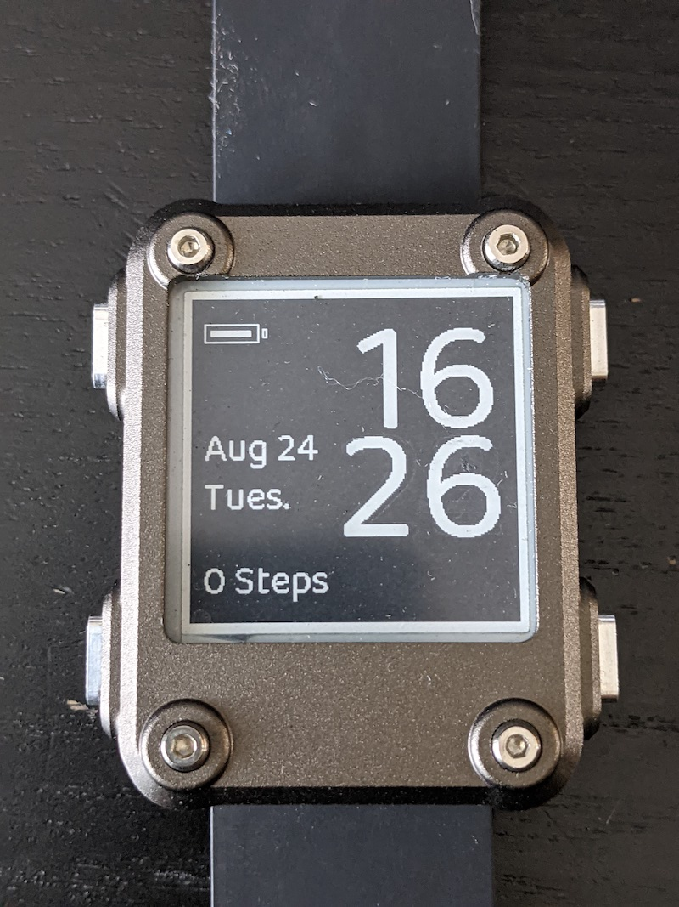

# Marina

The [Watchy](https://watchy.sqfmi.com/), by SQFMI, is a fully open source E-Paper watch and it's pretty cool. Having got one, I wanted to learn how to make my own watch face and this is my ongoing attempt. 

## Changelog

In version 1.0, the days of the week were too large for the display and ended up bleeding into the hour and minutes, which was a mess. This was fixed by editing TimeLib.h to show them in a shorter manner, so Tuesday becomes Tues.

I've included this edited version, if you wish to use it, you need to ensure it is placed within the the following directory when building this

`/.pio/libdeps/esp32dev/Time`

## Battery Life

With the tuning I've done of the code, you should see around 6 days battery reserve. This will vary depending on how active you are but I'm actively testing this so should have solid data soon. 